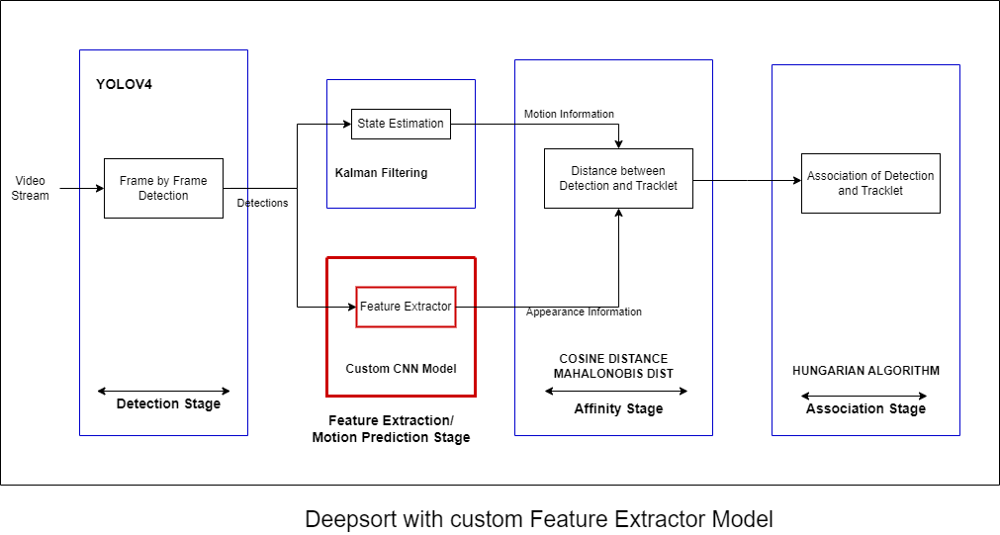
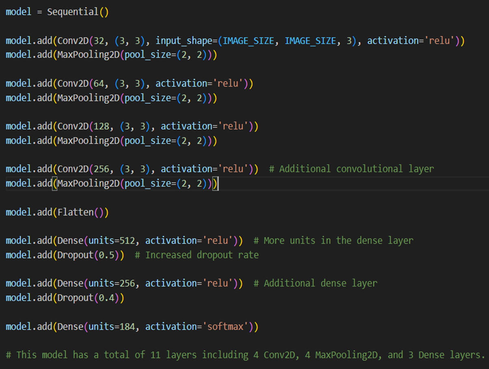
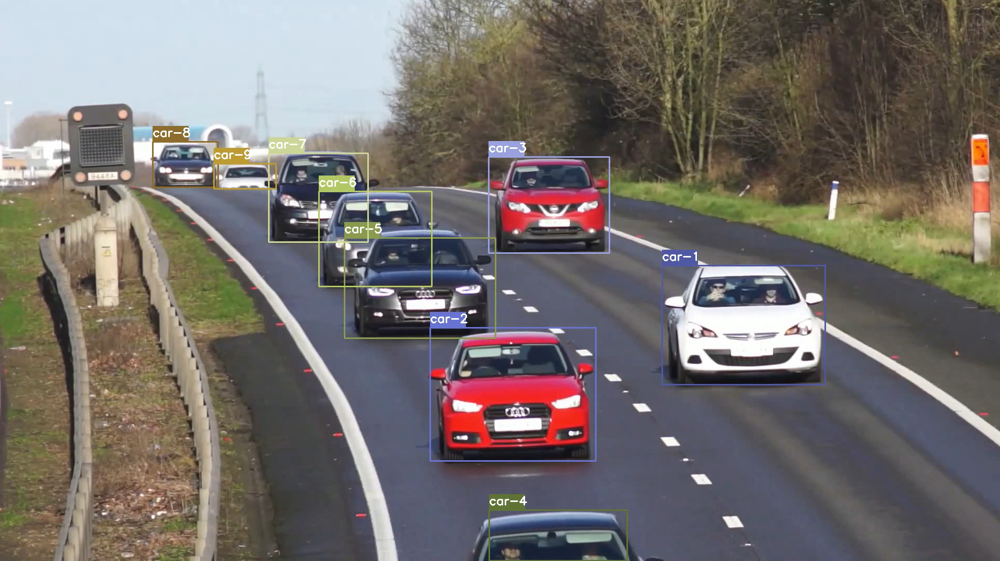

# Vehicle Tracking with Custom Feature Model in DeepSORT
## Motivation
Deepsort model internally uses a feature extractor model that is trained on
pedestrians. We intend to modify this by training that feature extractor model by vehicle dataset
instead of pedestrians so as to give better accuracy and results.

## Implementation:
In our project, we implemented a custom feature extractor model based on Convolutional
Neural Network (CNN), specifically designed to track vehicles in real-time traffic scenarios. This
model combined with the kalman filter gives accurate prediction of vehicles in the next state.
The CNN model was meticulously trained on a diverse dataset comprising various classes of
vehicles, ensuring robust detection across different types and sizes of vehicles. This training
enabled the model to accurately identify vehicles in video streams, even in challenging
conditions.

## Diagram:


A Pre-trained yolov4 model is used to give detections of vehicle class. These detections are
passed to our custom feature extractor CNN model and Kalman filter. The appearance vector
information from the feature extractor model is combined with the motion information from the
Kalman filter to give better prediction of objects in the next state. A cosine distance metric is
used for similarity calculation. The Hungarian algorithm calculates intersection over union (IOU)
for association between our prediction and tracklet.

## Feature Extractor Model

Feature Extraction model dataset comprising of about 184 different classes of cars for training and testing.
Total training images are about 18,400 cropped images of cars and test images are about 550.

### Access weights and dataset
weights and dataset - https://drive.google.com/drive/folders/1lWpMoyE733gAqb6XMG_MNQGOdcaKD79s?usp=drive_link

### Architecture


## Output - 



# INSTALLATION
Clone the repository - 
```
git clone https://github.com/prithvi1809/Vehicle_Tracking_With_Custom_Feature_Model.git
```
```
cd Vehicle_Tracking_With_Custom_Feature_Model
```

### Getting Started

To get started, install the proper dependencies either via Anaconda or Pip. I recommend Anaconda route for people using a GPU as it configures CUDA toolkit version for you.

### Conda (Recommended)

```bash
# Tensorflow CPU
conda env create -f conda-cpu.yml
conda activate yolov4-cpu

# Tensorflow GPU
conda env create -f conda-gpu.yml
conda activate yolov4-gpu
```

### Pip
(TensorFlow 2 packages require a pip version >19.0.)
```bash
# TensorFlow CPU
pip install -r requirements.txt

# TensorFlow GPU
pip install -r requirements-gpu.txt
```
### Nvidia Driver (For GPU, if you are not using Conda Environment and haven't set up CUDA yet)
Make sure to use CUDA Toolkit version 10.1 as it is the proper version for the TensorFlow version used in this repository.
https://developer.nvidia.com/cuda-10.1-download-archive-update2

## Downloading Official YOLOv4 Pre-trained Weights
Our object tracker uses YOLOv4 to make the object detections, which deep sort then uses to track. There exists an official pre-trained YOLOv4 object detector model that is able to detect 80 classes. For easy demo purposes we will use the pre-trained weights for our tracker.
Download pre-trained yolov4.weights file: https://drive.google.com/open?id=1cewMfusmPjYWbrnuJRuKhPMwRe_b9PaT
#### or 
https://drive.google.com/drive/folders/1lWpMoyE733gAqb6XMG_MNQGOdcaKD79s?usp=drive_link

Copy and paste yolov4.weights from your downloads folder into the 'data' folder of this repository.

If you want to use yolov4-tiny.weights, a smaller model that is faster at running detections but less accurate, download file here: https://github.com/AlexeyAB/darknet/releases/download/darknet_yolo_v4_pre/yolov4-tiny.weights


## Commands to run - 

### Save YOLOv4 Model
```
python save_model.py --weights ./data/yolov4.weights --output ./checkpoints/yolov4 --model yolov4
```
### Run yolov4 deep sort object tracker on video
```
python object_tracker.py --weights ./checkpoints/yolov4 --model yolov4 --video ./data/video/cars.mp4 --output ./outputs/cars.avi
```

### Run yolov4 deep sort object tracker with custom trained feature model on video
```
python object_tracker.py --weights ./checkpoints/yolov4 --model yolov4 --video ./data/video/cars.mp4 --output ./outputs/cars.avi --custom_feature_extractor_model
```

### save yolov4-tiny model
```
python save_model.py --weights ./data/yolov4-tiny.weights --output ./checkpoints/yolov4-tiny-416 --model yolov4 --tiny
```

### Run yolov4-tiny object tracker on video.
```
python object_tracker.py --weights ./checkpoints/yolov4-tiny-416 --model yolov4 --video ./data/video/cars.mp4 --output ./outputs/cars_tiny.avi --tiny
```

### Run yolov4-tiny object tracker with custom trained feature model on video.
```
python object_tracker.py --weights ./checkpoints/yolov4-tiny-416 --model yolov4 --video ./data/video/cars.mp4 --output ./outputs/cars_tiny.avi --tiny --custom_feature_extractor_model
```

### References  

   Huge shoutout goes to hunglc007 and nwojke for creating the backbones of this repository:
  * [tensorflow-yolov4-tflite](https://github.com/hunglc007/tensorflow-yolov4-tflite)
  * [Deep SORT Repository](https://github.com/nwojke/deep_sort)
